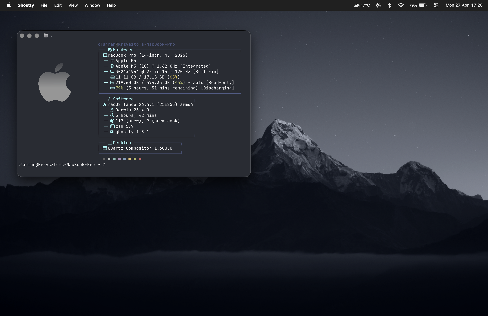

# macOS setup

Simple notes on setting up a new macOS device



## Terminal

Make the dock hide faster:

```bash
defaults write com.apple.dock autohide-delay -float 0
defaults write com.apple.dock autohide-time-modifier -float 0
killall Dock
```

Show hidden files in finder:

```bash
defaults write com.apple.finder AppleShowAllFiles -bool true
killall Finder
```

Get `homebrew`:

```bash
/bin/bash -c "$(curl -fsSL https://raw.githubusercontent.com/Homebrew/install/HEAD/install.sh)"
```

Install everything from homebrew:

```bash
brew install anomalyco/tap/opencode claude-code cmake codex discord fastfetch gh ghostty go helium-browser krisfur/tap/fex localsend mpv neovim neovim ninja node odin steam t3-code tree-sitter-cli typst uv zed zig
```

Install bun:

```bash
curl -fsSL https://bun.sh/install | bash
```

Get neovim and zed configs:

```bash
git clone https://github.com/krisfur/neovim-config.git
mkdir ~/.config/nvim
cd neovim-config
cp init.lua ~/.convig/nvim
cd zed
bash install.sh
cd ../..
```

Set up fastfetch:

```bash
fastfetch --gen-config
cp fastfetch/* ~/.config/fastfetch
```

Set up git config:

```bash
git config --global user.email "k_furman@outlook.com"
git config --global user.name "Krzysztof Furman"
git config --global init.defaultBranch main
```

## App Store:

- Final Cut Pro
- Garage Band
- Pixelmator Pro
- XCode

## Settings

- Accessibility -> Reduce transparency
- Desktop and Dock -> Scale Effect, Automatically hide, Turn off show suggested

- Add desktops 2, 3

- Enable desktop shortcuts:
    - System Settings → Keyboard → Keyboard Shortcuts… → Mission Control

    - System Settings -> Desktop and Dock -> Mission Control -> Turn Off Automatically rearrange spaces

- Keyboard -> Turn off Adjust keyboard brightness in low light

- Menu Bar -> Battery -> Show %

- Wallpaper -> Screen Saver -> Never
