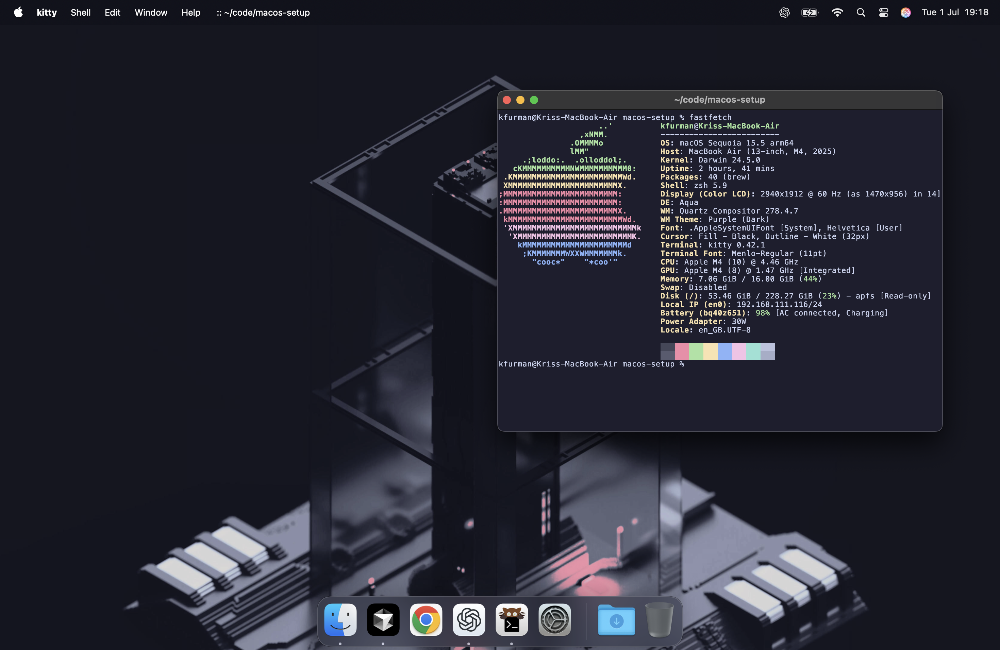

# macOS Setup Notes

Commands and notes for setting up a new macOS development environment.

## Usage

Copy commands from `setup.sh` and run them manually as needed.

## What's Included

- System tweaks (dock, finder)
- Homebrew package manager
- Development tools (C++, Rust, python3 + venv, Git, Go, Node.js, GitHub CLI)
- Terminal tools (Kitty, tmux, Neovim)
- Code editors (VS Code, Cursor)
- Useful CLI tools
- Apps (Chrome, ChatGPT)
- Programming fonts

## After Setup

1. `gh auth login`
2. Copy `kitty-theme.conf` to kitty config
3. Sign into VS Code and Cursor
4. Restart terminal 
